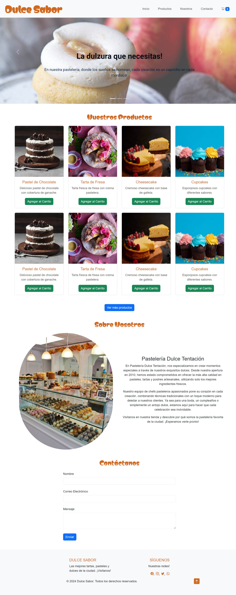

# Página Web hecha con Bootstrap

## Tabla de contenidos

* Descripción
* Características
* Tecnologías
* Uso
* Contacto

## Descripción

Este proyecto es una página web para una pastelería, desarrollada utilizando HTML, CSS, JavaScript y Bootstrap. Los usuarios pueden navegar por los productos existentes, agregarlos al carrito de compras, y conocer más en la sección "sobre nosotros" dedicada a la historia y la información de contacto de esta.

## Características

* Productos: Muestra los productos con imágenes, descripciones y precios.
* Carrito de Compras: Permite a los usuarios agregar productos al carrito, revisar y modificar su selección antes de realizar un pedido.
* Sección "Nosotros": Una página que cuenta la historia de la pastelería y misión.
* Contacto: Un formulario de contacto donde los usuarios pueden enviarnos mensajes directos.
* Redes Sociales: Enlaces directos a cuentas de redes sociales.

## Tecnologías

Este proyecto fue construido utilizando las siguientes tecnologías:

* HTML5: Estructura de la página.
* CSS3: Estilos y diseño visual.
* JavaScript: Funcionalidad interactiva del sitio.
* Bootstrap 5: Diseño responsivo y componentes preconstruidos.

## Uso

1. Navegación: Explora la página de inicio para ver los productos.
2. Carrito de Compras: Agrega productos al carrito y revisa tu selección.
3. Contacto: Envía un mensaje utilizando el formulario de contacto.

## Contacto

Linkedin: [Yanina Aranda](www.linkedin.com/in/yanina-aranda-87301b20a).

